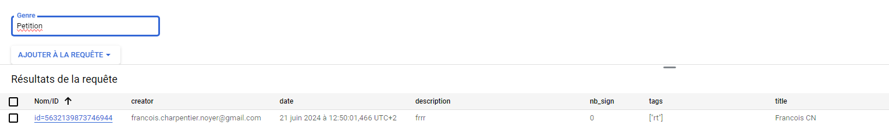
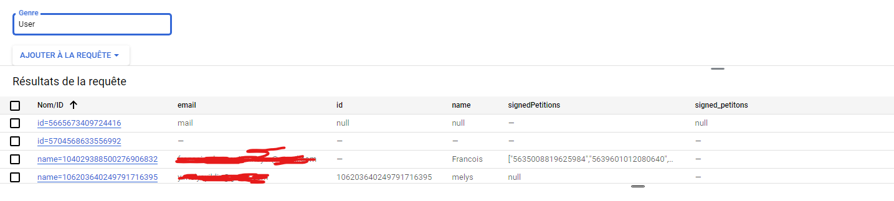

# Auteurs du projet

* Melys Yildiz
* François Charpentier--Noyer 

## Image des kinds du projet




## installation
```
mvn clean package
mvn endpoints-framework:openApiDocs
gcloud endpoints services deploy target/openapi-docs/openapi.json 
mvn appengine:deploy
```
## Aperçu
Ce projet vise à construire une application web pour créer, signer et gérer des pétitions, similaire à des plateformes comme Avaaz ou Change.org. L'application web prend en charge les fonctionnalités suivantes :

Créer une pétition
Signer une pétition (les utilisateurs sont authentifiés et ne peuvent pas signer plus d'une fois)
Lister les pétitions signées par un utilisateur, triées par date
Lister les 100 meilleures pétitions, triées par date
Taguer des pétitions et trouver des pétitions par tag, triées par date de création
Imprimer la liste de toutes les personnes ayant signé une pétition
L'application est conçue pour prendre en charge des millions de pétitions et de signatures.


## Fonctionnalités
### Créer une Pétition
Les utilisateurs peuvent créer une pétition en fournissant un titre, une description et des tags.

### Signer une Pétition
Les utilisateurs authentifiés peuvent signer des pétitions. Les utilisateurs ne peuvent pas signer une pétition plus d'une fois.

### Lister les Pétitions Signées par un Utilisateur
Les utilisateurs peuvent voir la liste des pétitions qu'ils ont signées, triées par date de signature.

### Lister les 100 Meilleures Pétitions
Affiche les 100 meilleures pétitions, triées par date de création.

### Trouver des Pétitions par Tag
Les utilisateurs peuvent rechercher des pétitions par tags, les résultats étant triés par date de création.

### Imprimer Tous les Signataires
Les utilisateurs peuvent voir la liste de toutes les personnes ayant signé une pétition spécifique.

### Captures d'Écran
Kinds de Google Datastore

## Statut
### Ce Qui Fonctionne :
Création de pétitions
Signature de pétitions avec authentification
Liste des pétitions signées par un utilisateur
Liste des 100 meilleures pétitions
Recherche de pétitions par tag
Affichage des signataires d'une pétition
### Ce Qui Ne Fonctionne Pas :